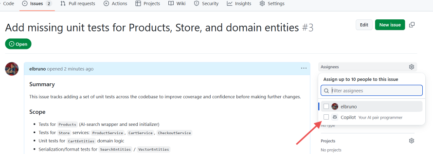
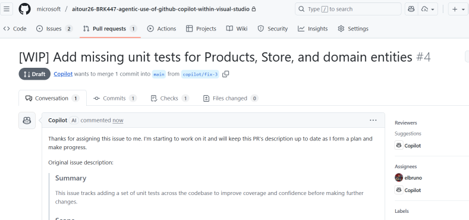
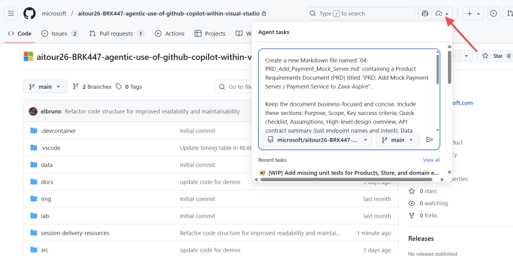

## How to deliver this session

🥇 Thanks for delivering this session!

Prior to delivering the workshop please:

1. Read this document and all included resources in their entirety.
2. Watch the recorded setup and demo videos referenced in the resources.
3. Ask questions of the content leads if anything is unclear — they're available to help.

## 📁 File Summary

| Resources | Links | Description |
|---|---|---|
| Session Delivery Deck | [Deck](https://aka.ms/AAxqj50) | The session delivery slides |
| Demo source code | [demo source code](../src/) | Demo Source Code |
| Demo source code BackUp | [demo source code backup](../srcBackUp/) | Source Code completed for each one of the demo steps |

## 🚀 Get Started

The workshop mixes short live demos with recorded segments for reference.

### 🕐 Timing

| Time | Description |  Video Links |
|---:|---|---|
| 03 mins | Introduction |  |
| 04 mins | demos | [02-Zava-Overview](https://aka.ms/AAxqc9f) <br/> [03-VS2022-and-GHCP-Overview](https://aka.ms/AAxqj53) |
| 03 mins | GH Copilot Agents | |
| 04 mins | demos  | [04-Add-single-unit-Test-for-AI-Search](https://aka.ms/AAxqc9g) |
| 05 mins | MCP Tools | content |
| 07 mins | demos | [05-add-mcp-servers](https://aka.ms/AAxqc9j) <br /> [(optional) 06-query-mcp-ms-learn](https://aka.ms/AAxq4rk) <br /> [07-Implement-unit-tests-using-GH-Issue](https://aka.ms/AAxqj52) |
| 03 mins | Coding Agent | content |
| 09 mins | demos | [08-update-ui-using-agent-based-on-images](https://aka.ms/AAxq4rn) <br /> [09-coding-agent-implement-payment-PRD](https://aka.ms/AAxqc9e) |
| 02 mins | WrapUp | content |

### 🏋️ Preparation

#### Essential Pre-Session Requirements

- Review the Initial Setup guide and recorded setup video:
  - [Initial Setup Guide](./docs/01-InitialSetup.md)
  - [01-Initial Setup](https://aka.ms/AAxqc9i)
- Set up Azure AI services and local development environment
- 2 hours before the live session, run the steps 1, 2 and 3 below to generate new content for the session.
- Optionally you can use these elements for the demo:
  - Sample Issue: [#3 - Add missing unit tests for Products, Store, and domain entities](https://github.com/microsoft/aitour26-BRK447-agentic-use-of-github-copilot-within-visual-studio/issues/3)
  - Pull Request to solve Issue #3: [PR #4](https://github.com/microsoft/aitour26-BRK447-agentic-use-of-github-copilot-within-visual-studio/pull/4)
  - Pull Request to generate PRD: [#5](https://github.com/microsoft/aitour26-BRK447-agentic-use-of-github-copilot-within-visual-studio/pull/5)

#### Step 1 - Create the GitHub Issue for Missing Unit Tests

Purpose: This step requires to create a GitHub Issue in the demo repository. The Issue content can be copy & paste from the existing issue [#3](https://github.com/microsoft/aitour26-BRK447-agentic-use-of-github-copilot-within-visual-studio/issues/3) or from the file [02-Create_Issue_for_unit_tests.md](./docs/02-Create_Issue_for_unit_tests.md).

#### Step 2 - Assing the new created isssue to Copilot

Assing the new created issue to GitHub Copilot.



Validate that once the issue is assigned, a new PR should be created, similar to this one.



## Step 3 - Instruct Copilot Coding Agent to Create a PRD

Open the Agent Panel, and use the following prompt to ask Copilot Coding Agent to create a PRD.

**Prompt:**

```text
Create a new Markdown file named `04-PRD_Add_Payment_Mock_Server.md` containing a Product Requirements Document (PRD) titled "PRD: Add Mock Payment Server / Payment Service to Zava-Aspire". See [04-PRD_Add_Payment_Mock_Server.md](./docs/04-PRD_Add_Payment_Mock_Server.md).

Keep the document business-focused and concise. Include these sections: Purpose, Scope, Key success criteria, Quick checklist, Assumptions, High-level design overview, API contract summary (just endpoint names and intent), Data model summary (tables/fields at a high level), Implementation notes (brief: suggest a Blazor Server service, DB, and Store integration), Configuration & local defaults (suggested env keys and local port), Security & privacy notes, Testing & validation, Acceptance criteria, Rollout plan, and an Appendix with example request/response JSON.

Use clear headings, bullet lists, and short code blocks for the example JSON.

Example file metadata: Date (today's date), Author: (current user) & Copilot (documentation draft).
```

Reference:



This should also create a corresponding Pull Request for review.

### 🖼️ Demos

All demos reference the userguide files in the `session-delivery-resources/` folder. For each demo use the referenced minimal userguide for talking points and follow a short 1–2 step demo flow. If a demo is fragile or long-running, prefer a recorded segment.

| Demo | Description |
|---|---|
| [Architecture / Zava Overview](/session-delivery-resources/02-Zava-Overview/brk447-02-Zava%20Overview-en-US-01-minimal.md) | High-level architecture and key components — keep to the big picture. |
| [Copilot Features in Visual Studio](/session-delivery-resources/03-VS2022-and-GHCP-Overview/brk447-03-VS2022%20and%20GHCP%20Overview-en-US-01-minimal.md) | Ask vs Agent modes, completions, and quick edits inside Visual Studio. |
| [AI Search & Unit Testing](/session-delivery-resources/04-Add-single-unit-Test-for-AI-Search/brk447-04%20Add%20single%20unit%20Test%20for%20AI%20Search-en-US-01-minimal.md) | TDD flow with Copilot scaffolding unit tests and validating results. |
| [MCP Servers](/session-delivery-resources/05-add-mcp-servers/brk447-05%20add%20mcp%20servers-en-US-01-minimal.md) | Brief explanation and one quick verification of a configured MCP tool. |
| [Querying Documentation (MCP)](/session-delivery-resources/06-query-mcp-ms-learn/brk447-06-query%20mcp%20ms%20learn-en-US-01-minimal.md) | Show how the Agent can consult Microsoft Learn or other docs to suggest code changes. |
| [Issue-Driven Development with Agent](/session-delivery-resources/07-Implement-unit-tests-using-GH-Issue/brk447-07-Implement%20unit%20tests%20using%20GH%20Issue-en-US-01-minimal.md) | Show the issue briefly and the Agent's plan/patch workflow (use a short prerecorded clip if long). |
| [Image-Based UI Updates](/session-delivery-resources/08-update-ui-using-agent-based-on-images/brk447-08-update%20ui%20using%20agent%20based%20on%20images-en-US-01-minimal.md) | Show before/after images and the Agent's suggested UI changes (use recorded clip if applying changes is time-consuming). |
| [Implement Payment Service](/session-delivery-resources/09-coding-agent-implement-payment-PRD/brk447-09-coding-agent-implement-payment-PRD-en-US-01-minimal.md) | Show how Coding Agent can implement a full Payment service (use recorded clip if applying changes is time-consuming). |

For each demo keep live interactions short and reserve complex changes for recorded segments.
